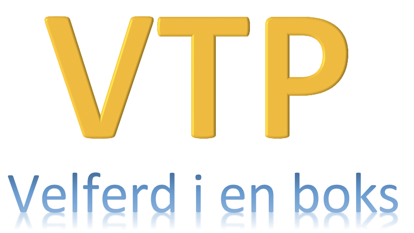

[](https://sonarcloud.io/dashboard?id=navikt_vtp)
[](https://sonarcloud.io/dashboard?id=navikt_vtp)
[](https://sonarcloud.io/dashboard?id=navikt_vtp)
[](https://sonarcloud.io/dashboard?id=navikt_vtp)
[](https://sonarcloud.io/dashboard?id=navikt_vtp)
Virtuell Tjeneste Plattform (VTP)
=================================



#### VTP hjelper deg med å: 
- virtualisere grensesnitt rundt applikasjonene i FP-familien. 
- instansierer og holde testdata konsistente på tvers av grensesnittene
- ha en plattform for å simulere grensesnitt over REST, SOAP, Kafka, LDAP.
- sikkerhetshåndtering over OAuth2
- REST-grensesnitt for å programatisk opprette testdata (for automatiske tester) 
- GUI for å opprette testdata for mennesker.

# Henvendelser

- Team Foreldrepenger <teamforeldrepenger(at)nav.no>
- Team Sykdom-i-familien

## For NAV-ansatte
Interne henvendelser kan sendes via Slack i kanalen #vtp-chatten

## Teknologi som må installeres
- Java (https://adoptopenjdk.net/)
- Maven (http://maven.apache.org/)

## Starte applikasjon
For utvikling på VTP benytt oppsett for å starte server gjennom IDE.
I verdikjedetester benyttes oftest Docker-image av VTP. Dette bygges i VTP sin pipeline. 

Når applikasjonen har startet blir Swagger tilgjengelig på http://localhost:8060/swagger/

#### Starte backend-server via IDE
* IntelliJ må konfigureres med å sette classpath of module til server, og sette working directory til `$MODULE_WORKING_DIR$` i run/debug-konfiguration.
* Start mock serveren ved å kjøre MockServer (lokalt).

#### Kjøre via docker run / docker-compose
##### For å bygge docker image lokalt: 
Bygg prosjektet med `mvn clean install"`, bygg deretter docker-imaget med `docker build -t vtp .` 
Imaget blir da tilgjengelig som vtp:latest

##### Hente docker-image bygget i pipe: 
docker pull ghcr.io/navikt/vtp (dette krever at en allerede logget inn med docker hos ghcr.io)

## Opprette testdata 
Testscenarios opprettes ved hjelp av `TestscenarioRestTjeneste.java`. Her sende man inn en JSON-string av testpersonen(e),
testpersonen blir instansiert i VTP og tilgjengliggjort i alle mockene, og den instansierte testpersonen returneres.

JSON objektet har følgende struktur og godtar at en eller flere felter mangler:

```json5
{
     "scenario-navn": "",
     "personopplysninger": {  },
     "inntektytelse-annenpart": {  },
     "inntektytelse-søker": {  },
     "organisasjon": {  },
     "vars": {  }
 }
```
Eksempel på hvordan en kan gjøre dette befinner seg i `model/src/test/ScenarioTest.java` med hjelpeklassen 
`model/src/test/TestscenarioHenter.java`. Hjelpeklassen leser av .json filer og oversetter det til en JSON streng som
kan bli brukt i requesten.

## Kjør tester
* Automatiske tester for FPSAK (og andre FP*-familieapplikasjoner) ligger i eget repo på GitHub (private): [fpsak-autotest](https://github.com/navikt/fpsak-autotest)
* Automatiske tester for K9-applikasjoner ligger i eget repo på GitHub (private): [k9-verdikjede](https://github.com/navikt/k9-verdikjede)
 

## Sertifiakter for SSL/TLS
For å få VTP til å kjøre med SSL/TLS forbindelse over SOAP, REST og Kafka må keystore angitt i VTP være tilgjengelig i SUT (System under test) sin Truststore. 
For lokal utvikling på Team Foreldrepenger og Sykdom-i-familien opprettes key- og truststore i.h.t til instruksjoner i verdikjede/autotest. 
Følgende systemvariabler kan defineres for å overstyre defaults i VTP: 

```bash
JAVAX_NET_SSL_TRUSTSTORE
JAVAX_NET_SSL_TRUSTSTOREPASSWORD
NO_NAV_MODIG_SECURITY_APPCERT_KEYSTORE
NO_NAV_MODIG_SECURITY_APPCERT_PASSWORD
```

## Konfigurere nye tjenester
Se SoapWebServerConfig for liste over url til genererte wsdl'er. Nye webtjenester registreres her. 
Se ApplicationConfig for liste over registrerte REST-tjenester. Nye REST-tjenester registreres her.     

## Kjente feil 
Swagger-codegen kommer med en recuring problem med manglende SLF4J binding (see https://github.com/swagger-api/swagger-codegen/issues/12135)
