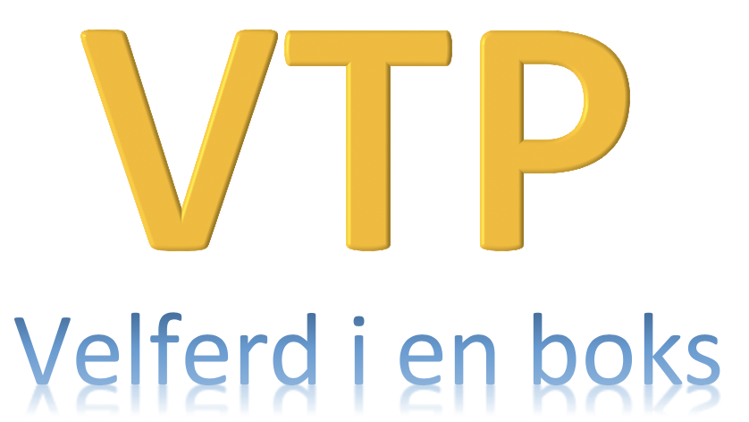

Virtuell Tjeneste Plattform (VTP)
=================================



VTP hjelper deg med å: 
- virtualisere grensesnitt rundt applikasjonene i FP-familien. 
- instansierer og holde testdata konsistente på tvers av grensesnittene
- ha en plattform for å simulere grensesnitt over REST, SOAP, Kafka, LDAP.
- sikkerhetshåndtering over OAuth2
- REST-grensesnitt for å programatisk opprette testdata (for automatiske tester) 
- GUI for å opprette testdata for mennesker.

# Henvendelser

Team Foreldrepenger <teamforeldrepenger(at)nav.no>

## For NAV-ansatte

Interne henvendelser kan sendes via Slack i kanalen #vtp-chatten


# Hvordan komme igang - Oppsett og konfigurasjon

* VTP trenger Keystore og Truststore liggende i mappe `.modig` på brukerens hjemme-mappe, eller konfigurert gjennom verdier angitt i avsnitt om sikkerhet.

guide for å sette Keystore og Truststore: https://howtodoinjava.com/maven/how-to-install-maven-on-windows/

* Intelliji må konfigureres med å sette classpath of module til server, og sette working directory til `$MODULE_WORKING_DIR$` i run/debug-konfiguration.

## Teknologi, må være installert før du fortsetter
* Node.js (https://nodejs.org/en/download/)
* Yarn (https://classic.yarnpkg.com/en/docs/install/#windows-stable)
* Java (https://www.oracle.com/java/technologies/javase-jdk11-downloads.html)
* Maven (http://maven.apache.org/download.cgi)

Etter installsjon må du legge til enviorment variabler for `MAVEN_HOME`, `JAVA_HOME`. Samt sette path i system envoirment.

guide windows: https://howtodoinjava.com/maven/how-to-install-maven-on-windows/

guide linux (max er basert på linux, så burde være likt):
```
$EDITOR ~/.profile
/#add lines at the bottom of the file:  
     export MAVEN_HOME, =/~/jdk-x.x.x/
     export JAVA_HOME=/~/apache-maven-x.x.x
```

## Starte backnend-server via IDE
----
* Start mock serveren ved å kjøre MockServer (lokalt).
* Trenger parameter `-Dscenarios.dir="../model/scenarios"` dersom denne ikke ligger under working dir (dvs. i IDE).
* Swagger UI: **https://localhost:8063/swagger/** - Bruk HTTP for kall
* SoapWebServiceConfig.java inneholder endepunker for virtuelle tjenester.

## Starte frontend-server via Shell
---
* Kjør `run-java.sh` i en CLI (kan bruke gitbash). Dette gjøres i root mappen til vtp prosjektet.

##Front-end
---
* I mappen frontend (~vtp/frontend) kjør `yarn run serve`. Når VTP bygges så pakkes det også med en statisk versjon av front-end som er tilgjengelig på rot av localhost:8060 eller https://localhost:8063.
* Dersom bygg feiler på utviklerimage, forsøk å oppdater node / yarn. Oppdaterte versjoner ligger på http://a34apvl063.devillo.no:81/software/.  


Opprette testdata 
----
* Opprett testdata ved å lage scenario i /model/scenarios. Innledende tall brukes som referanse for å få instansiert scenario fra Autotest. 

Kjør tester
----
* Automatiske tester for FPSAK (og andre FP*-familieapplikasjoner) ligger i eget repo på GitHub (private): [fpsak-autotest link](https://github.com/navikt/fpsak-autotest)

Koble FP*-applikasjoner til VTP
------

* Start applikasjonen med `--vtp` i oppstartsparameterne for å gå mot VTP istedet for testmiljø. 

Sikkerhet
----
For å få VTP til å kjøre med SSL/TLS forbindelse over SOAP, REST og Kafka må keystore angitt i VTP være tilgjengelig i SUT (System under test) sin Truststore. 
For lokal utvikling på Team Foreldrepenger er trust- og keystore distribuert. På laptop kan disse genereres selv. Følgende systemvariabler kan defineres for å overstyre defaults i VTP. 
Alias for sertifikatet er localhost-ssl

```bash
JAVAX_NET_SSL_TRUSTSTORE
JAVAX_NET_SSL_TRUSTSTOREPASSWORD
NO_NAV_MODIG_SECURITY_APPCERT_KEYSTORE
NO_NAV_MODIG_SECURITY_APPCERT_PASSWORD
```


Utvikling, wsdl
----
Se SoapWebServerConfig for liste over url til genererte wsdl'er. Nye webtjenester registreres her. 
Se ApplicationConfig for liste over registrerte REST-tjenester. Nye REST-tjenester registreres her. 


### Kjøre via docker run / docker-compose
Lagt til noen forenklinger på environment variabler når vi kjører opp VTP + Autotest i docker. Se
`./resources/pipeline/readme.md` for mer info. Test certifikater er allerede lagt inn i imaget. Men man må
fortsatt sette path riktig.


Bygge vtp lokalt. Imaget blir da tilgjengelig som vtp:latest
```
docker build -t vtp . 
```
